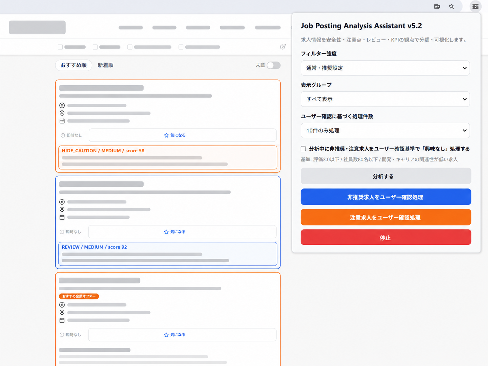

# 求人票分析・分類支援 Chrome拡張機能

Project Name: Job Posting Filter Extension

## 概要

転職活動中に多数の求人を確認する負担を減らすために作成した、個人用 Chrome 拡張機能です。

求人一覧ページに表示される求人票情報をもとに、Java / Spring との関連性、SES・派遣・契約リスク、会社規模、年収条件などを判定し、求人を KEEP / REVIEW / HIDE_CAUTION / HIDE_SAFE に分類・可視化します。

単純なキーワード検索ではなく、自分の転職活動で重視している条件をルール化し、求人確認作業を効率化することを目的としています。

## 開発背景

転職活動を進める中で、毎日多くの求人を確認する必要がありました。

特に、今後 Java / Spring の実務経験を積みたいと考えているため、求人ごとに Java との関連性、開発経験につながるかどうか、SES・派遣・契約リスク、会社規模、年収条件などを確認する必要がありました。

この確認作業を毎回手作業で行う負担が大きかったため、自分の判断基準をルール化し、求人一覧上で優先度を確認できる Chrome 拡張機能を開発しました。

## 主な機能

- 求人一覧ページ上の求人カード情報の取得
- 求人票テキストの分析
- Java / Spring との関連性判定
- SES・客先常駐・派遣・契約リスクの検出
- 運用保守・テスト・インフラ・ヘルプデスクなどの非開発リスク検出
- 年収条件の確認
- 会社規模に関するシグナルの確認
- 外部情報参照による評価・口コミ数・社員数の補助確認
- KEEP / REVIEW / HIDE_CAUTION / HIDE_SAFE への分類
- 求人カード上への判定バッジ表示
- chrome.storage.local による分析結果のキャッシュ
- pageshow / MutationObserver による画面復帰時のバッジ復元
- ユーザー確認後の処理実行

## 分類基準

| 分類 | 内容 |
|---|---|
| KEEP | 条件に合う可能性が高く、優先的に確認したい求人 |
| REVIEW | 判断材料が不足しており、手動確認が必要な求人 |
| HIDE_CAUTION | 条件に合わない可能性が高いが、念のため注意して確認する求人 |
| HIDE_SAFE | 条件に合わない可能性が高く、非表示候補にできる求人 |

## Java キャリア判定

| 判定 | 内容 |
|---|---|
| Java STRONG | Java / Spring / Spring Boot などが明確に記載されている |
| Java MEDIUM | Java 配属の可能性はあるが、確定ではない |
| MODERN_WEB | Web 開発要素はあるが、Java との関連は弱い |
| WEAK | 開発関連性が弱い |
| NONE | Java / Web 開発との関連性が見えない |

## 技術スタック

- JavaScript
- Chrome Extension Manifest V3
- HTML / CSS
- DOM 操作
- MutationObserver
- chrome.runtime messaging
- chrome.storage.local
- chrome.tabs
- chrome.scripting
- async / await
- 正規表現によるテキスト分析
- 外部情報参照ロジック
- キャッシュ処理
- fallback 処理

## ファイル構成

```text
job-posting-filter-extension
├── manifest.json
├── background.js
├── content.js
├── popup.html
├── popup.js
└── README.md
```

### manifest.json

Chrome 拡張機能の設定ファイルです。  
対象 URL、権限、content script、background service worker などを定義しています。

### content.js

求人一覧ページ上で実行されるメイン処理です。  
求人カードの抽出、求人テキスト分析、判定バッジ表示、DOM 監視、キャッシュ復元を担当します。

### background.js

外部情報参照や content script とのメッセージ処理を担当します。

### popup.html / popup.js

拡張機能の操作画面です。  
分析実行やユーザー確認後の処理実行の入口として使用します。

## 工夫した点

### 実際の課題から逆算した設計

学習用のサンプルアプリではなく、実際の転職活動で発生していた求人確認作業の負担を減らすために作成しました。

求人票を単なる文字列ではなく、キャリア判断に必要な非構造化データとして扱い、ルールベースで分類しました。

### Chrome Extension の構成

content script、background service worker、popup の役割を分け、chrome.runtime messaging を使って処理を連携させました。

画面上で動作する処理、外部情報参照を行う処理、ユーザー操作の入口となる popup を分けることで、機能ごとの責務を整理しました。

### DOM 再生成への対応

詳細ページから一覧ページに戻った際に、画面側で DOM が再生成され、追加した判定バッジが消える問題がありました。

この問題に対して、chrome.storage.local に分析結果を保存し、pageshow と MutationObserver を使って判定バッジを復元する仕組みを実装しました。

### 安全性を考慮した処理

誤操作を防ぐため、HIDE_SAFE と HIDE_CAUTION を分け、ユーザー確認後に処理を実行する設計にしました。

条件に合わない可能性が高い求人でも、すぐに処理対象とするのではなく、REVIEW や HIDE_CAUTION として手動確認できる余地を残しています。

### 外部情報取得失敗時の fallback

外部情報は常に取得できるとは限らないため、取得できない場合でも処理全体が止まらないように fallback 処理を実装しました。

外部情報が取得できない場合でも、求人票テキストをもとに分類を継続できるようにしています。

## 苦労した点と解決方法

### content script が接続できない問題

最初は popup から処理を実行しても、content script が対象ページに接続できないことがありました。

原因として、manifest.json の matches 設定が対象 URL と一致していないことや、content script が未注入の状態で popup からメッセージ送信される可能性がありました。

対応として、対象 URL を明示し、popup.js 側で chrome.scripting.executeScript による fallback 注入を追加しました。

### 外部情報が不明になりやすい問題

当初は一部の求人だけ外部情報を参照していたため、判断材料が不足するケースがありました。

対応として、画面上に表示されている会社名ありの求人について、一定件数まで外部情報を参照するように変更しました。

### 詳細ページから戻るとバッジが消える問題

求人詳細ページから一覧ページに戻ると、表示済みの判定バッジが消えることがありました。

原因は、画面側で DOM が再生成され、拡張機能が追加した要素が失われていたことです。

対応として、chrome.storage.local に分析結果を保存し、pageshow と MutationObserver を使って復元する仕組みを実装しました。

### Java との関連性が弱い求人が残る問題

会社規模や有名企業シグナルを強く評価しすぎると、Java との関連性が弱い求人も KEEP になってしまうことがありました。

対応として、会社規模シグナルは HIDE_SAFE を防ぐ補助要素にとどめ、Java との関連性が弱い場合は REVIEW に制限するよう調整しました。

## 使い方

1. このリポジトリをダウンロードします。
2. Chrome で `chrome://extensions/` を開きます。
3. 右上の「デベロッパーモード」を ON にします。
4. 「パッケージ化されていない拡張機能を読み込む」をクリックします。
5. 本プロジェクトのフォルダを選択します。
6. 対象の求人一覧ページを開き、拡張機能を実行します。

## 今後の改善予定

- 判定ルールを設定画面から変更できるようにする
- 判定理由をより見やすく表示する
- 求人ごとのメモ機能を追加する
- 会社ごとの分析結果を一覧化する
- TypeScript 化によって保守性を高める
- 判定ルールを外部ファイル化する
- スコアリングロジックに対する単体テストを追加する
- Java / Spring / AWS など希望技術ごとのスコアリング精度を改善する

## 注意事項

本ツールは、個人の転職活動における求人確認作業を効率化する目的で作成した個人用ツールです。

特定サービスの公式ツールではありません。

外部情報については、公開ページ上の情報参照補助として利用しており、取得結果は求人判断の補助材料として扱っています。

また、ユーザー操作を伴う処理については、誤操作を防ぐためユーザー確認後に実行する設計にしています。

## 画面イメージ

以下は、求人一覧ページ上に判定バッジを表示し、Chrome 拡張機能の popup から分析条件やユーザー確認処理を操作する画面イメージです。

実際の求人情報・企業名・サービス名などは、ポートフォリオ掲載用に匿名化しています。


